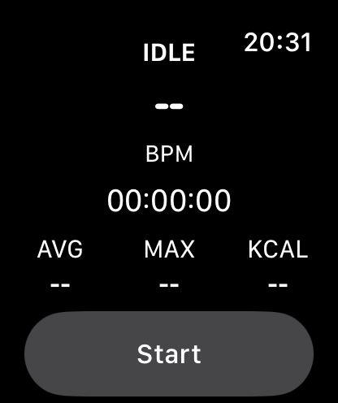
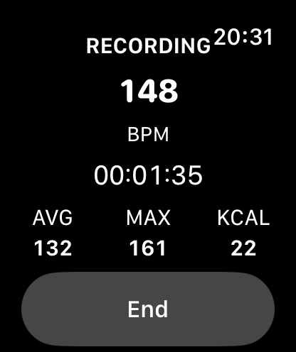
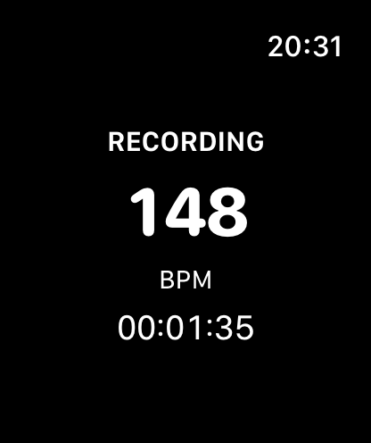

# SimPulse

[](https://github.com/marcatos/SimPulse/actions/workflows/ci.yml)

**Heart rate, calories, and sim-racing telemetry — on the same timeline.**

SimPulse is a local-first biometric platform for sim racers. An Apple Watch records a real Sim Racing workout in HealthKit. A Windows Bridge watches iRacing. The iPhone is where those two worlds meet: what your body did, and what happened on track, correlated without a cloud account.

This is not a calorie counter with a racing skin. The product is **synchronization**.

> SimPulse is early, public, and not an App Store release yet. Watch recording, iPhone session list/detail, and the Windows Bridge (including live iRacing mmap) are real; live Race Reports and App Store distribution are the next slice.

---

## Why it exists

Sim racing is a sport that Apple Fitness and iRacing both underserve:

- Apple Watch will happily log “Other” while you sit in a GT3 for two hours. It does not know the car, the track, or the lap that spiked your heart rate.
- iRacing knows every tyre, every incident, every sector. It does not know you.
- Consumer fitness apps optimize for jogging. They do not answer “what happened in the sim when HR peaked?”

SimPulse is built so a solo racer with an Apple Watch and a Windows PC can ask those questions — and get answers that are measurements, not medical advice.

**First wearable stack:** Apple Watch, iPhone, HealthKit.  
**First simulator:** iRacing on Windows.

## Who it is for

Solo sim racers who already race on a Windows PC and wear an Apple Watch. If you want a social network, a recovery score, or a cloud dashboard, this is the wrong project. If you want local data, pairing you control, and a Race Report that can name the lap — you are in the right place.

## How it works

```text
Apple Watch                 iPhone                      Windows PC
┌─────────────┐            ┌──────────────┐            ┌──────────────────┐
│ HealthKit   │ WatchConn. │ Session store│   LAN      │ SimPulse Bridge  │
│ Sim Racing  │───────────►│ Analytics    │◄──────────►│ iRacing adapter  │
│ Glance UI   │            │ Race reports │  Protocol  │ PIN pairing      │
└─────────────┘            └──────────────┘     v1     └──────────────────┘
```

1. **Watch** starts and ends a Sim Racing workout. Recording continues if the iPhone is unreachable.
2. **HealthKit** is the source of truth for heart rate, active energy, and workout bounds.
3. **Bridge** runs on the racing PC, detects iRacing, normalizes session/lap/race events, and speaks a versioned JSON protocol over the LAN — only after an explicit PIN pair.
4. **iPhone** (in progress) stores SimPulse session metadata, correlates clocks with an explicit timeline offset, and will render history and Race Reports.

No SimPulse cloud. Heart-rate samples are not written to the Windows PC in the intended architecture. Correlation happens on the iPhone.

## Watch UI

Glanceable on purpose: large current HR, elapsed time, Idle/Recording. Always On keeps the core metrics and hides Start/End and secondary stats.

| Idle | Recording | Always On |
| --- | --- | --- |
|  |  |  |

Simulator captures (Apple Watch Series 11, 46 mm). See [`docs/screenshots/watchos/`](docs/screenshots/watchos/).

## What is shipping vs next

| Capability | Status |
| --- | --- |
| Start / end Sim Racing workout on Watch (HealthKit) | **Shipped** — unit tested; companion unreachability does not stop recording |
| Glanceable live UI (HR, elapsed, Always On) | **Shipped** — simulator screenshots above |
| Persist workout and sync summary to iPhone | **Shipped** — unit tested; paired-device E2E still KI-008 |
| iPhone session history, charts, Race Report UI | Session list + detail shipped; Race Report UI next |
| Windows Bridge host, PIN pairing, tray UX | **Shipped** — fixture-tested |
| iRacing memory-mapped session reader | **Shipped** — live replay smoke 2026-08-19 |
| LAN protocol v1 (JSON, pairing, TLS, time-sync) | **Shipped** TLS default; IOS-005 client pin pending |
| Analytics: HR/energy summaries, Race Report model, lap/event windows | **Shipped** as pure C# libraries |
| App Store / TestFlight / StoreKit | Not started |

Honest snapshot for agents and humans: [`docs/CURRENT_STATE.md`](docs/CURRENT_STATE.md). Product questions and tiers: [`docs/PRODUCT.md`](docs/PRODUCT.md).

## Principles

- **Local-first.** Core features do not require an account or a SimPulse server.
- **Biometrics stay on Apple hardware.** HealthKit holds workouts. The Bridge carries simulator context, not HR samples.
- **Not a medical device.** Analytics describe measurements. No diagnosis, stress score, or recovery coaching.
- **Clocks are not magic.** Every sample carries a timestamp **and a clock source**. Correlation uses an explicit offset, not “the clocks matched.”
- **Smallest real slice.** Watch → iPhone → Bridge → report, before a zoo of simulators and wearables.
- **No GPL in the shipping apps.** iRacing telemetry is a first-party mmap reader, not a GPL wrapper.

## Repository layout

Monorepo. C# is the executable contract language on Windows; Swift lives next to it for Watch and iPhone. JSON Schema is the language-neutral wire contract.

```text
/
├── apps/
│   ├── ios/                 # SwiftUI iPhone app + XCTest
│   ├── watchos/             # Independent Watch app (HealthKit workout)
│   └── windows-bridge/      # .NET 8 Bridge host (tray + worker)
├── packages/
│   ├── protocol/            # Protocol v1 envelope, codec, JSON Schema
│   ├── domain-model/        # Simulator-independent domain + entitlements
│   └── analytics/           # Pure metrics and RaceReport (no UI)
├── docs/                    # Architecture, ADRs, privacy, backlog
├── scripts/                 # Windows + macOS build/test helpers
├── tests/fixtures/          # Protocol and telemetry fixtures for CI
└── .github/workflows/       # .NET CI; Apple job is an explicit placeholder
```

Why this split: [ADR 0001](docs/adr/0001-monorepo-structure.md), [ADR 0007](docs/adr/0007-language-split.md).

## Getting started

### Windows (Bridge and analytics)

Requires Git and [.NET SDK 8](https://dotnet.microsoft.com/download).

```powershell
dotnet test SimPulse.sln --configuration Release
pwsh -File scripts/test-bridge.ps1
```

Run the Bridge against a fixture (no live iRacing required):

```powershell
$env:SIMPULSE_LOG_LEVEL = "Information"
$env:SIMPULSE_FIXTURE_PATH = ".\tests\fixtures\telemetry\iracing-practice-short.json"
dotnet run --project apps/windows-bridge/SimPulse.Bridge --property:OutputType=Exe
```

On a normal Windows build the host is `WinExe`: pairing PIN in the notification-area tray, file logs under `%LOCALAPPDATA%\SimPulse\logs`. Details: [`apps/windows-bridge/README.md`](apps/windows-bridge/README.md), [`docs/DEVELOPMENT.md`](docs/DEVELOPMENT.md).

### macOS (Watch and iPhone)

Requires Xcode and [XcodeGen](https://github.com/yonaskolb/XcodeGen). Do not hand-edit `SimPulse.xcodeproj` for routine source changes — edit `project.yml` and regenerate ([ADR 0012](docs/adr/0012-xcodegen-apple-project.md)).

```sh
xcodegen generate
./scripts/test-ios.sh
./scripts/build-watch.sh
```

On Windows those Apple scripts record **NOT EXECUTED**. That is intentional: this repo must stay useful without a Mac.

## Protocol and pairing

Bridge ↔ iPhone uses versioned JSON over WebSocket on the LAN after PIN pairing. Unknown fields and unknown message types are ignored. Pairing is required before telemetry. TLS and a per-device reconnect secret are planned (known issues KI-003, KI-006).

Schemas: `packages/protocol/schemas`. Design: [ADR 0003](docs/adr/0003-bridge-protocol.md). Security notes: [`docs/SECURITY.md`](docs/SECURITY.md).

## Privacy

| Data | Where it lives |
| --- | --- |
| Heart rate, active energy, workout bounds | HealthKit on the user’s Apple devices |
| Simulator, track, car, laps, race events | Bridge in memory during a session; iPhone session store (planned) |
| Trusted PC identity | Local pairing store on the Bridge — not biometrics |
| SimPulse cloud | None |

No advertising identifiers. No third-party analytics SDK by default. Never log raw HR or energy payloads. Full write-up: [`docs/PRIVACY_ARCHITECTURE.md`](docs/PRIVACY_ARCHITECTURE.md).

HealthKit has no honest sport type for sim racing, so workouts use `HKWorkoutActivityType.other` plus Sim Racing metadata.

## Documentation map

| Doc | What it is |
| --- | --- |
| [`docs/CURRENT_STATE.md`](docs/CURRENT_STATE.md) | What actually works today |
| [`docs/PRODUCT.md`](docs/PRODUCT.md) | Vision, non-goals, Free / Premium / Pro (billing not implemented) |
| [`docs/ARCHITECTURE.md`](docs/ARCHITECTURE.md) | Hexagonal layout, clocks, persistence |
| [`docs/BACKLOG.md`](docs/BACKLOG.md) | Work items and dependencies |
| [`docs/adr/`](docs/adr/) | Accepted architecture decisions |
| [`docs/TESTING.md`](docs/TESTING.md) | How we verify without hardware |
| [`docs/AGENTS.md`](docs/AGENTS.md) | Operating rules if you are an automated agent in this repo |
| [`docs/KNOWN_ISSUES.md`](docs/KNOWN_ISSUES.md) | Defects and platform gaps |

Canonical operational status for maintainers lives on the project tracker, not in GitHub Issues.

## Roadmap (near term)

The vertical slice we will not skip:

1. Watch workout already records.
2. Sync the summary to iPhone even if the phone was gone mid-stint.
3. Local session history and a real detail view.
4. Pair the Bridge, ingest iRacing session metadata.
5. Correlate biometric and simulator timelines.
6. A Race Report that can leave fields **unavailable** rather than invent them.

Later, maybe: more sims, TestFlight, optional cloud. Not before the slice above exists.

## Contributing

The repository is **public for visibility**. Source license terms for redistribution are **not** an OSI-approved open-source license yet — see below. Please do not assume PRs will be merged. If you want to collaborate, open a discussion with the copyright holder first.

Do not file secrets, pairing stores, or raw biometric dumps. Do not treat GitHub Issues as the project tracker.

## Trademarks

Apple, Apple Watch, HealthKit, and iPhone are trademarks of Apple Inc. iRacing is a trademark of iRacing.com Motorsport Simulations, LLC. SimPulse is an independent project and is not affiliated with, endorsed by, or sponsored by Apple or iRacing.

## License

Copyright (c) 2026 Simone Marcato. All rights reserved.

You may not use, copy, modify, merge, publish, distribute, sublicense, or sell copies of this software except with explicit written permission, until a public license is published in [`LICENSE`](LICENSE).
